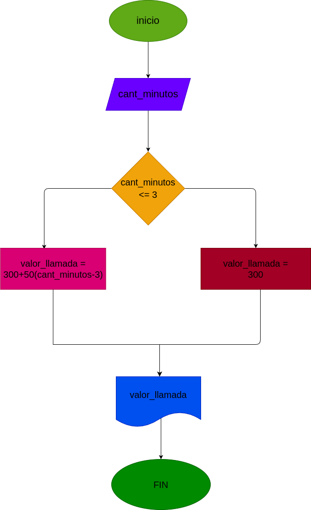

# Condicionales_1

## Costos de una llamada telefónica

Ingresar el tiempo de duracion de una llamada telefonica y determinar la cantidad a pagar de acuerdo a lo siguiente: 
- Toda llamado que dure 3 minutos o menos tiene un costo de 300 pesos.
- Cada minuto adicional cuesta 50 pesos. 

## input

### Variables de entrada
cant_minutos: cantidad de minutos que duro la llamada
### prosesisng
valor_llamada: calcular el valor final de la llamada

si es menor o igual a 3 minutos: el valor final sera de 300 pesos

si es mayor a 3 minutos : 300+50*(cant_minutos-3)

### output
valor_llamada
# Diseño

 
# Construcción

